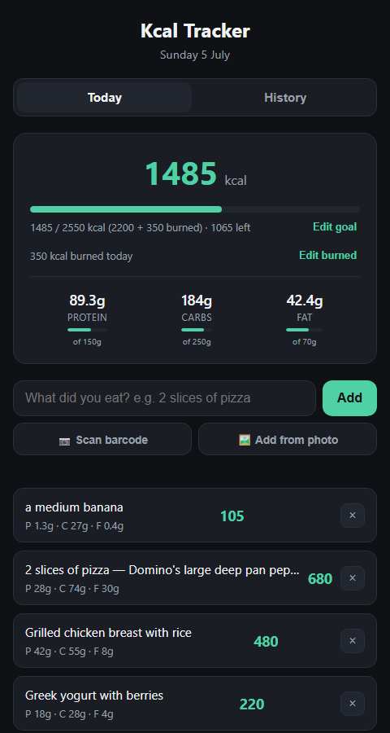
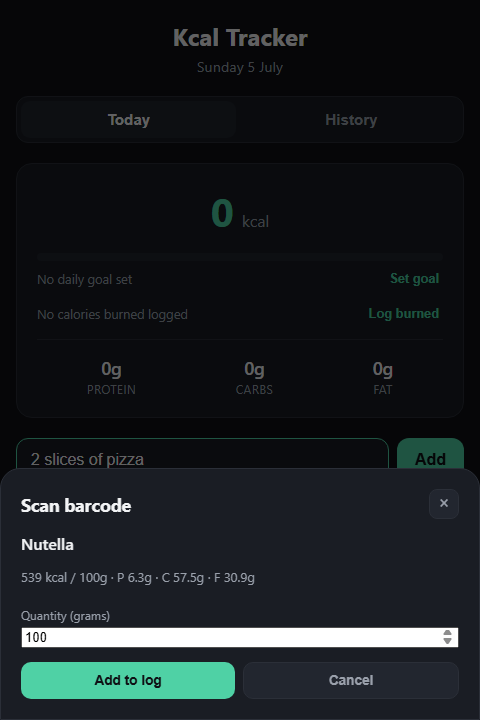
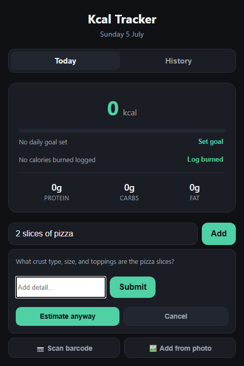

# Kcal Tracker

A calorie and macro tracker you actually keep using — log food by typing
it, scanning a barcode, or taking a photo, and see your daily totals
against a goal in real time.

**Live app:** https://kcal-tracker-seven.vercel.app/

**Repo:** https://github.com/Luke-AI-Developments/Kcal-Tracker

<p>
  
  
  
</p>

## Why I built this

Most calorie trackers are either bloated with subscriptions and ads, or
require picking foods out of a database one item at a time. I wanted
something that works the way I actually think about food — "2 slices of
pizza", "200g chicken breast" — and gets out of the way. Building it was
also a chance to build a complete, real, daily-use product end to end:
a plain-JS front end, a secret-holding backend, three different input
methods, and a couple of small AI-product problems (quantity scaling,
knowing when to ask a follow-up question) that don't have textbook
answers.

## Features

- **Type it** — "a bowl of oatmeal with berries" or "3 slices of pizza"
  gets sent to a Groq-hosted LLM, which scales the estimate to the
  exact quantity described rather than a generic single serving.
- **Ask before guessing** — for foods where the answer genuinely
  depends on missing detail (pizza, sandwiches, burgers, branded
  packaged food), the app asks one short clarifying question instead
  of silently guessing. Well-defined foods (a banana, a chicken breast)
  are answered immediately with no back-and-forth.
- **Scan a barcode** — the phone camera reads a UPC/EAN barcode
  (`html5-qrcode`), looks the product up in the free
  [Open Food Facts](https://world.openfoodfacts.org/) database, and
  lets you confirm the quantity before it's scaled and logged.
- **Snap a photo** — take a picture of packaging (ideally with the
  weight and nutrition label in frame) and a Groq vision model
  identifies the product and estimates calories/macros for the
  quantity you type.
- **Daily goals** — set a calorie goal plus optional protein/carbs/fat
  targets; each gets its own progress bar with the gram target shown
  underneath.
- **Calories burned** — log exercise calories manually to see net
  calories against an expanded goal ("2000 + 400 burned").
- **History** — past days listed with totals, expandable to see each
  day's individual entries.
- **Installable PWA** — add-to-home-screen on a phone, works offline
  for anything already loaded, and a network-first service worker
  means new deployments always show up without a stale cache trap.

## Tech stack

Plain HTML, CSS, and vanilla JavaScript — no framework, no build step,
no bundler. Every file is short enough to read start to finish, which
was a deliberate choice: I wanted the whole app to be explainable in an
interview, including the parts that are usually hidden behind a
framework's magic.

- **Frontend:** static HTML/CSS/JS, `localStorage` for persistence
- **Backend:** two tiny Vercel serverless functions (`api/lookup.js`,
  `api/vision-lookup.js`) that hold the Groq API key server-side — the
  browser never sees it
- **Nutrition lookup:** [Groq](https://groq.com/) (`openai/gpt-oss-120b`
  for text, `meta-llama/llama-4-scout-17b-16e-instruct` for vision) —
  free tier, no credit card
- **Barcode data:** [Open Food Facts](https://world.openfoodfacts.org/)
  API, called directly from the browser (public, no key needed)
- **Barcode scanning:** [html5-qrcode](https://github.com/mebjas/html5-qrcode),
  vendored locally rather than loaded from a CDN, so it keeps working
  offline
- **Hosting:** [Vercel](https://vercel.com/) free tier, auto-deployed
  from GitHub on every push

## A few implementation details worth knowing

- **The Groq key never reaches the browser.** The frontend calls
  `/api/lookup` and `/api/vision-lookup`, which are serverless
  functions holding `GROQ_API_KEY` as a private environment variable.
  Since the code is in a public repo, anyone could read a key embedded
  client-side and burn through the free quota.
- **Quantity scaling is prompted explicitly, not assumed.** The model
  is told to find a per-unit reference (one slice, 100g) and scale
  linearly to the exact amount described, with worked examples in the
  prompt. Without this, LLMs tend to default to "one typical serving"
  regardless of what quantity you actually typed.
- **The one-round clarification cap is enforced in code, not just by
  prompting.** A "give me a final answer" request uses a completely
  separate system prompt that has no "ask a question" option in its
  output schema at all — so the cap holds even if the model doesn't
  follow instructions perfectly.
- **The service worker is network-first, not cache-first.** An earlier
  cache-first version meant anyone who'd loaded the app before a given
  feature shipped would never see it, since the worker never re-checked
  the network for already-cached files. Network-first with an offline
  fallback fixes that permanently.

## Project structure

```
index.html                 page structure
style.css                  styling
app.js                     all client-side logic
api/lookup.js              serverless: text -> Groq -> calories/macros
api/vision-lookup.js       serverless: photo + quantity -> Groq vision -> calories/macros
manifest.json, sw.js       PWA manifest + service worker
icons/, favicon.png        app icons (generated by scripts/generate-icons.js)
vendor/                    vendored html5-qrcode (not CDN-loaded)
dev-server.js              zero-dependency local server mirroring the Vercel routes
scripts/generate-icons.js  one-off script that drew the app icons as raw PNG bytes
```

## Running it locally

```bash
npm run dev
```

This starts `dev-server.js` on `http://localhost:3000` — a small
Node server that serves the static files and mounts the same
`api/lookup.js` / `api/vision-lookup.js` handlers Vercel runs in
production, so you don't need the Vercel CLI or an account to develop
locally.

You'll need a free [Groq API key](https://console.groq.com/) in a
`.env` file (see `.env.example`):

```
GROQ_API_KEY=your-key-here
```

## Deployment

Pushes to `main` auto-deploy via Vercel. `GROQ_API_KEY` is set as a
Vercel project environment variable, never committed to the repo.

## License

MIT — see the vendored `html5-qrcode` library in `vendor/` for its own
Apache-2.0 license and attribution.
